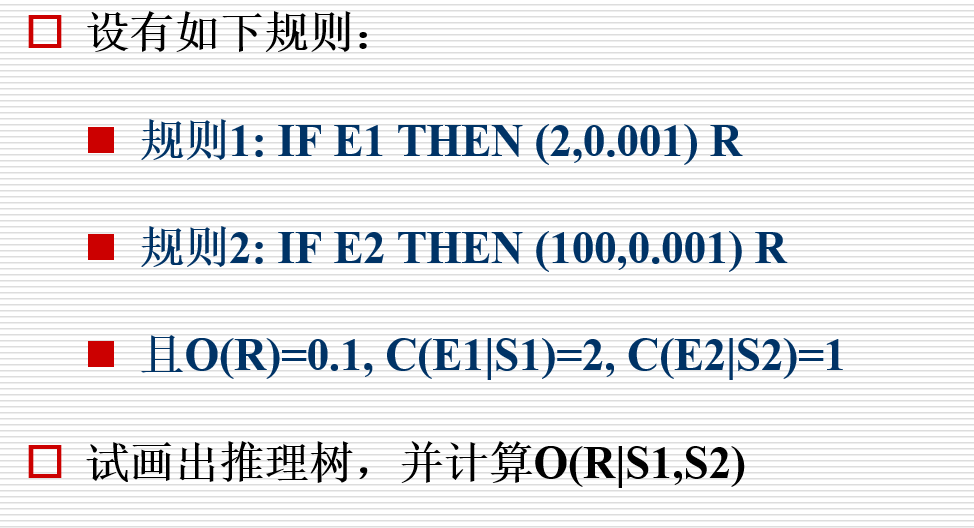
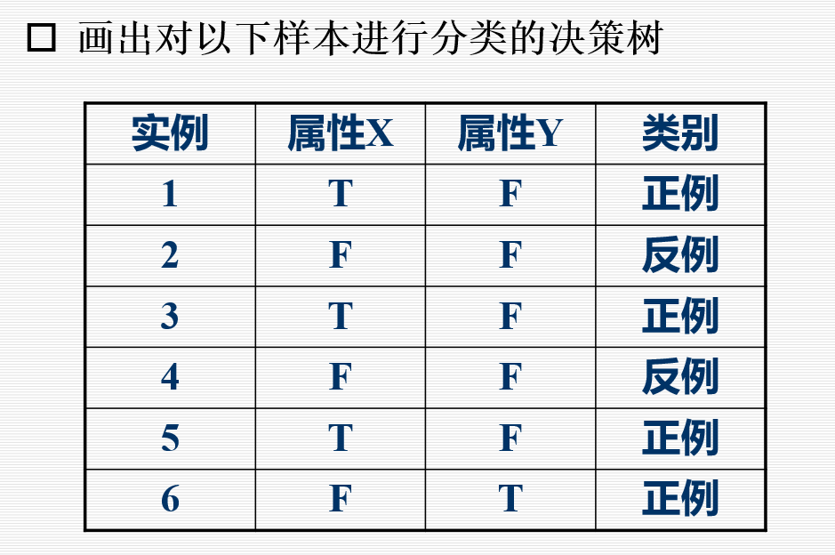
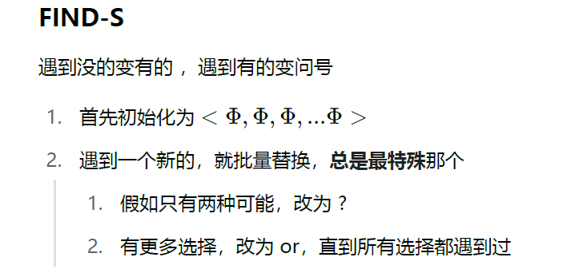

# 人工智能知识点总结

[toc]

## 题型

+ 填空
+ 选择
+ 计算
+ 综合（设计画图）


## 第1章 绪论

### 复习要点： 人工智能的定义、图灵测试、三大流派及其主要思想、AI学科诞生等


1. **人工智能的定义**：

   用人工的方法在机器（计算机）上实现的智能；或者说是人们使机器具有类似于人的智能。

   - **强人工智能**：机器**真正具有人的感知、思维和意识**
   - **弱人工智能**：机器只能**部分模仿和实现**人的智能

2. **图灵测试：**

   1950年图灵发表的《计算机与智能》中设计了一个测试，用以说明人工智能的概念。

   * 采用“问”与“答”模式，即观察者通过控制打字机向两个测试对象通话

   * 其中一个是人，另一个是机器。要求观察者不断提出各种问题，从而辨别观察者是人还是机器

     

3. **三大流派及其主要思想：**
   1. **符号主义（逻辑主义，心理学派，计算机学派）**：
      * **功能模拟、符号推演**
        - 人类认知的基本元素是**符号**，认知的过程就是符号处理的过程。
        - 是人工智能研究中**最早使用也是现在还在使用**的主要方法。这种方法一般是利用显式的知识和逻辑推理来解决问题的。
   2. **连接主义（仿生学派，生理学派）**：
      * **结构模拟、神经计算**
        * 结构模拟就是模拟人脑的生理结构和工作机理，实现计算机的智能。
        * 人脑是一个动态的、开放的、高度复杂的庞大信息系统。一时还不能对它做到真正和完全模拟，只是对它的局部或近似模拟。
      * 结构模拟法是基于人脑的**生理模型**，采用**数值计算**的方法，从微观上模拟人脑，实现机器智能
        * 使用**人工神经网络**作为信息和知识的载体
        * 用**神经计算的方法**实现学习、联想、识别和推理等功能
        * 从而来模拟人脑的智能行为，使计算机表现出某种智能
   3. **行为主义（进化主义）**：
      * **行为模拟、控制进化**
        * 行为模拟法基于感知-行为模型，模拟人在控制过程中的智能活动和行为特性，如自寻优、自适应、自学习、自组织等来研究和实现人工智能。
      * 行为主义强调**智能系统与环境的交互**，认为智能取决于感知和行动，人的智能、机器智能可以**逐步进化**，但只能在现实世界中与周围环境的交互中体现出来。
      * 智能只能**放在环境中**才是真正的智能，智能的高低主要表现在**对环境的适应性**上。

4. **人工智能的历史回顾**
   1. 神经元网络时代
   2. 通用方法时代
   3. 知识工程时代
   4. 神经网络时代
   5. 数据与网络时代

## 第2章 知识表示及确定性推理

### 复习要点：命题符号化、命题公式的计算及分类、命题公式的关系，谓词逻辑，传统推理的理论基础、三大组成部分、推理树

1. **命题符号化**：
​	将（复合）命题用<font color="red">命题标识符和联结词</font>等符号表示

2. **命题公式的计算及分类：**
   1. **命题公式**：由有限个命题常量，命题变量，联结词，括号等组成的字符串。精确定义如下：
   
      > 1. $0, 1$和$命题变元$是命题公式
      > 2. 如果$A, B$是命题公式,那么$\neg A, A \wedge B, A \vee B, A \rightarrow B, A\leftrightarrow B$都是命题公式
      > 3. $C$为命题公式当且仅当$C$为有限次使用(1)和(2)所产生的字符串
   
   2.  **重言式、矛盾式、可满足式**：
   
      * **重言式（永真式）**：命题公式$A(a_1,a_2,...,a_n)$在任何一组真值指派下的真值都为$1$
      * **矛盾式（永假式）**：命题公式$A(a_1,a_2,...,a_n)$在任何一组真值指派下的真值都为$0$
      * **可满足式**：命题公式$A(a_1,a_2,...,a_n)$在至少一组真值指派下的真值都为$1$
   
3. **命题公式的关系**：

   * <font color="red">等价</font> $A \iff B$ : 即$A \leftrightarrow B$是重言式
   * <font color="red">蕴含</font> $A \Longrightarrow B$：即$A \rightarrow B$是重言式

4. **谓词逻辑**：
   **谓词逻辑表示法**

   > e.g. $Friends(Zhang San, x)$

   + 优点：
     + 自然性
     + 准确性
     + 严密性
     + 容易实现  
   + 缺点
     + 不能表示**不确定**的知识
     + 组合爆炸
     + 效率低
   + 应用
     + 自动问答系统
     + 机器人行动规划系统
     + 机器博弈系统
     + 问题求解系统

5. **传统推理的理论基础**：

   * 推理是从**已知事实（证据）**出发，运用相关**知识（或规则）**，逐步推导出**结论**的思维过程。

   * 基于传统逻辑的推理：

     * 原始证据是**确定**的
     * 推理规则是**确定**的
     * 所以结论也是确定的，又称确定性推理

   * 人类简单推理的过程是<font color="red">基于传统的命题逻辑和谓词逻辑</font>

     * **假言推理:**

       $((A\rightarrow B)\wedge A)\Rightarrow B$

     * **假言三段论：**
     
       $((A\rightarrow B) \wedge (B \rightarrow C))\Rightarrow (A \rightarrow C)$
     
     * **推理链式规则：**
     
       $P_1\wedge(P_1\rightarrow P_2)\wedge(P_2\rightarrow P_3)\wedge\dots\wedge(P_n\rightarrow P_{n+1})\Rightarrow P_{n+1}$

6. **三大组成部分：**

   （**传统推理技术**三大组成部分）

   * **知识库：**包含一系列的规则
   * **综合数据库：**包含已知的命题
   * **推理机：**采用链式规则推理

7. **推理树：**

   * 任何一个推理过程都可用一棵<font color="red">推理树</font>表示

   * 树节点分为：<font color="red">与节点</font>、<font color="red">或节点</font>

     **与节点：**  
     
     </img>
     
     
     
     **或节点：**
     
     </img>
     
     
     
   * **综合数据库**

     * 原始证据
       * 对应于推理树的**叶节点**
       * 只能由用户提供
       * 不能推理得到
     * 中间结论
       * 对应于推理树的**中间节点**
     * 最后结论
       * 对应于推理树的**根节点**


 *以下复习要点没有，但感觉还是可以粗浅看一下*  


**产生式表示法**

   $e.g.$

   > 确定性规则: $IF \quad P \quad THEN \quad Q$,  $\quad P \rightarrow Q$  
   >
   > 不确定性规则: $IF \quad P \quad THEN \quad Q \quad(置信度)$，  $\quad P \rightarrow Q (置信度)$  


**框架表示法**

一种**结构化**的知识表示方法

$e.g.$

```
框架名: <教师>
姓名: (姓、名)
年龄: 
性别: range(男， 女)
     缺省(男)
职称: range(教授，副教授，讲师，助教)
     缺省(讲师)
部门: (系， 教研室)
住址: <住址框架>
工资: <工资框架>
开始工作时间: 单位(年、月)

```


## 第3章 不确定性推理

### 复习要点：可信度及其取值含义、不确定性的传递算法及合成、带加权因子的可信度推理


1. **可信度及其取值含义**

   * 信任增长度 $\mathrm{MB}$

     * $\mathrm{MB}(h,e)$：在证据$e$下对结论$h$的**信任度增加量**

       
       $\displaystyle \mathrm{MB}(h,e)= \left\{\begin{array}{l} 1,\ 若P(h)=1 \\ \displaystyle\frac{\max[P(h|e),P(h)]-P(h)}{\max[1, 0] - P(h)},\ 其他 \end{array}\right.$
       

   * 不信任增长度 $\mathrm{MD}$

     * $\mathrm{MD}(h,e)$：在证据$e$下对结论$h$的**不信任度增加量**
     
       $\displaystyle \mathrm{MD}(h,e)= \left\{\begin{array}{l} 1,\ 若P(h)=0 \\ \displaystyle\frac{\min[P(h|e),P(h)]-P(h)}{\min[1, 0] - P(h)},\ 其他 \end{array}\right.$

   * $\mathrm{MB}、\mathrm{MD}$的互斥性：

     * $\mathrm{MB}>0$时，$\mathrm{MD}=0$

     * $\mathrm{MD}>0$时，$\mathrm{MB}=0$

     * 结论：当证据e存在时，不可能**同时提高**结论h的可信度增加量和不可信度增加量

       

   * **可信度定义：**$\mathrm{CF}(h,e)$表示<font color="red">在证据e出现的前提下，结论h为真的概率变化程度</font>

     $\mathrm{CF}(h,e)=\mathrm{MB}(h,e)-\mathrm{MD}(h,e)$

     $\displaystyle \mathrm{CF}(h,e)= \left\{\begin{array}{l} 1,\ P(h)=1 \\ \displaystyle\mathrm{MB}(h,e),\ P(h|e)>P(h) \\ 0, \ P(h|e)=P(h) \\ -\mathrm{MD}(h,e), P(h|e) < P(h) \\ -1, P(h)=0\end{array}\right.$

     * $\mathrm{CF}(h,e)$本身不是概率，可以为<font color="red">负数</font> 

2. **不确定性的传递算法及合成**

   * **可信度因子**$\mathrm{CF}(E)$

     * 表示**证据的不确定程度**

     * 取值范围$[-1, 1]$;证据观察的结果为<font color="red">真或假的程度</font>

     * 当$E = E_1 \; AND \; E_2 \; AND \; \dots \; AND \; E_n$时

       $CF(E) = \min\{CF(E_1), CF(E_2),\dots,CF(E_n)\}$

     * 当$E = E_1 \; OR \; E_2 \; OR \; \dots \; OR \; E_n$时

       $CF(E) = \max\{CF(E_1), CF(E_2),\dots,CF(E_n)\}$

   * **不确定性的传递算法**

     * $CF(H) = CF(H,E) \times \max\{0, CF(E)\}$

   * **结论不确定性的合成算法**

     * $IF \; E_1 \; THEN \; H(CF(H,E_1))$

     * $IF \; E_2 \; THEN \; H(CF(H,E_2))$

     * 利用每一条规则，分别计算

       * $CF_1(H) = CF(H,E_1) \times \max\{0, CF(E_1)\}$

       * $CF_2(H) = CF(H,E_2) \times \max\{0, CF(E_2)\}$

         > [!NOTE]
         >
         > 此处不同于 $IF \; (E_1 \; OR \; E_2) \; THEN \; H$

       * <font color="red">则两条规则下的结论可信度合成公式</font>

         $\displaystyle \mathrm{CF_{1,2}}(H)= \left\{\begin{array}{l} CF_1(H)+CF_2(H)-CF_1(H)\times CF_2(H),\ 若CF_1(H),CF_2(H) \geq 0 \\ CF_1(H)+CF_2(H)+CF_1(H)\times CF_2(H),\ 若CF_1(H),CF_2(H) < 0\\ \displaystyle\frac{CF_1(H)+CF_2(H)}{1-\min\{|CF_1(H)|,|CF_2(H)|\}}, \ 若CF_1(H)与CF_2(H)异号 \end{array}\right.$

3. **带加权因子的可信度推理**

   * $IF \; E_1(\omega_1) \; AND \; E_2(\omega_2) \; AND \; \dots \; E_n(\omega_n) \\ THEN \; H(CF(H,E)) $，其中$0\leq\omega_i\leq1,i=1,2,\dots,n \\ \sum_{i=1}^n\omega_i=1$

​		当$E = E_1(\omega_1) \; AND \; E_2(\omega_2) \; AND \; \dots \; E_n(\omega_n)$时，可信度计算公式为：

​		$\displaystyle CF(E) = \sum_{i=1}^n\omega_i\times CF(E_i) \\ 或 CF(E) = \frac{1}{\displaystyle\sum_{i=1}^n\omega_i}\sum_{i=1}^n\omega_i\times CF(E_i)$

​		第一条公式在<font color="red">已经归一化</font>的条件的条件下成立	

## 第4章 模糊推理

### 复习要点：模糊集合的表示及其各种运算，贴近度，简单模糊推理的计算


1. <font color="red">模糊集合的表示及其各种运算</font>

   * $设U是论域，称映射A(x):U\rightarrow[0,1]确定了一个U上的模糊子集A，称映射A(x)为A的隶属函数，它表示x对A的隶属程度$

   * 当映射$A(x)$**只取0或1**时，**模糊子集$A$就是经典子集**

   * **模糊集合的表示：**

     * 形式一

       $A = \displaystyle\frac{\mu_1}{x_1} + \frac{\mu_2}{x_2} + \dots + \frac{\mu_n}{x_n}$

     * 形式二

       $A = \displaystyle\int_{u\in U} \frac{\mu_A(u)}{u}$

     * 1.  <font color="red">一个有限论域上可以对应无限个模糊子集</font>，而经典子集是有限的
       2. 一个模糊子集的隶属函数的确定方法是**主观**的

   * **模糊集合运算：**

     * **相等：**设有两个模糊集合$A$和$B$，$A = B$当且仅当它们的隶属函数在论域$U$上恒等，即

       $\forall x \in U,\mu_A(x)=\mu_B(x)$

     * **包含：**$A$包含于$B$当且仅当对于论域$U$上

       $\forall x \in U,\mu_A(x) \leq \mu_B(x)$

     *  **并**

       $\forall x \in U,(A \bigcup B)(x) = \max\{\mu_A(x),\mu_B(x)\}$

     *  **交**

       $\forall x \in U,(A \bigcap B)(x) = \min\{\mu_A(x),\mu_B(x)\}$

     *  **补集**

       $\forall x \in U,\neg A(x) = 1 - A(x)$

     *  **积**

       $A \times B = \displaystyle\int_{U\times V}\frac{(\mu_A(u_i)\wedge\mu_B(v_j))}{(u_i,v_j)}$

       - 其中$A$和$B$分别是论域$U$和$V$​上的模糊集合

     </img>  

   <details>
       <summary>
       答案
       </summary>
       </img>  
   </details>
   
   
   
   

   * **模糊关系**

     * 设$U$、$V$是论域，从$U$到$V$上的模糊关系$R$是指$U\times V$上的一个模糊集合，由<font color="red">隶属函数</font>$\mu_R(x,y)$表示$(x,y)$之间的关系

     * 当论域$U$、$V$是有限集时，模糊关系$R$常采用矩阵来表示，此时它又称为<font color="red">模糊关系矩阵</font>

     * 模糊关系矩阵的乘法（合成）

       * 设$R是$$U\times V$上的模糊关系矩阵，$S$是$V\times W$上的模糊关系矩阵

       * 则$U\times V$上的模糊关系矩阵$T = R \circ S$:

         * 若$R$为$m\times n$阶矩阵，$S$为$n\times k$阶矩阵，则$T$是$m\times k$ 阶矩阵，且运算公式为：

           $T_{ij} = \bigcup\limits_{k=1}(r_{ik}\wedge s_{kj})$，其中$\vee\wedge$分别代表取极大和极小值运算；$\bigcup\limits_{k=1}$代表连续取极大值
   
     * **贴近度**

       令$A$、$B$分别是论域$U = \{u_1,u_2,\dots,u_n\}$上的模糊集合，它们的贴近度定义为：

       ​	$\displaystyle(A,B) = \frac{1}{2}[A\bullet B + (1 - A * B)]$，其中：$A\bullet B = \bigvee\limits_U(\mu_A(u_i)\wedge\mu_B(u_i))$，$A*B = \bigwedge\limits_U(\mu_A(u_i)\vee\mu_B(u_i))$ 

       ​	$\bigwedge$表示取极小，$\bigvee$表示取极大

       ​	

       > [!CAUTION]
       >
       > 注意：$A\bullet B$ 和$A\circ B$的区别

       **例: 设论域$U = \{a,b,c,d,e\}$，$U$上定义的模糊集**

       ​	 $\displaystyle A = \frac{0.6}{a} + \frac{0.8}{b} + \frac{1}{c} + \frac{0.8}{d} + \frac{0.6}{e} \\ B = \frac{0.4}{a} + \frac{0.6}{b} + \frac{0.8}{c} + \frac{1}{d} + \frac{0.8}{e}$

       ​	求贴近度$(A,B)$?

       解：$A\bullet B = (0.6\wedge0.4)\vee (0.8\wedge0.6)\vee (1\wedge0.8)\vee (0.8\wedge1)\vee (0.6\wedge0.8) \\ =0.4\vee0.6\vee0.8\vee0.8\vee0.6 = 0.8$
   
       ​	$A* B = (0.6\vee0.4)\wedge (0.8\vee0.6)\wedge (1\vee0.8)\wedge (0.8\vee1)\wedge (0.6\vee0.8) \\ =0.6\wedge0.8\wedge1\wedge1\wedge0.8 = 0.6$
   
       ​	得$\displaystyle(A,B) = \frac{1}{2}[0.8 + (1 - 0.6)] = 0.6$
   
       
   
       * **模糊推理及模糊决策的计算**
   
         *  简单模糊推理
   
           * 规则的前提$E$是单一条件
           * 结论$R$不含$CF$

         *  知识表示形式

           * $\mathrm{IF \; x \; is \; A \; THEN \; y \; is \; B(\lambda)}$
   
         * <font color="red">推理方法及步骤</font> 
   
           * 首先计算$A$和$B$之间的模糊关系$R$
   
           * 通过$R$与前提的合成求出结论

             * 如果已知证据是 $x \; is \; A'$ 且$(A,A')\geq\lambda$，则有结论 $y \; is \; B'$，其中 $B' = A'\circ R$

             * <font color="red">计算R</font>

               1. <font color="red">极大极小原则</font>计算$R_m$
               2. <font color="red">算数原则</font>计算$R_a$ 
   
               设$\displaystyle A = \int\limits_U\frac{\mu_A(u)}{u},B = \int\limits_V\frac{\mu_A(v)}{v}$，则
   
               * $\displaystyle R_m = (A\times B)\bigcup(\neg A\times V)  
                 				=\int\limits_{U\times V}(\mu_A(u)\wedge\mu_B(v))\vee(1-\mu_A(u))/(u,v)$

                 即$R_m(i,j) = (\mu_A(u_i)\wedge\mu_B(v_j))\vee(1-\mu_A(u_i))$

               * $\displaystyle R_a = (\neg A\times V)\oplus(U\times B) = \int\limits_{U\times V}1\wedge(1-\mu_A(u)+\mu_B(v))/(u,v)$

                 即$R_a(i,j) = 1\wedge(1-\mu_A(u_i)+\mu_B(v_j))$

                 其中$A\oplus B = \min\{1,\mu_A(u)+\mu_B(v)\}$

             * 对于模糊假言推理，已知证据为$x \; is \;A'$且$(A,A')>\lambda$，则可由$R_m$和$R_a$计算得到$B_m'$和$B_a'$

               $B_m' = A'\circ R_m = A'\circ[(A\times B)\bigcup(\neg A\times V)]$

               $B_a' = A'\circ R_a = A'\circ[(\neg A\times V)\oplus(U\times B)]$​
   
           $e.g.$
   
           设 $U \; = \; V = \{ 1,2,3,4,5 \}$, $A \; = 1/1 + 0.5/2$， $B = 0.4 / 3 + 0.6 / 4 + 1 / 5$  
   
           模糊规则为 $IF \quad x \; is \; A \quad THEN \quad y \; is \; B( \lambda )$  
   
           证据为 $x \; is \; A'$, $A' \; = 1 / 1 + 0.4 / 2 + 0.2 / 3$，
   
           且有$(A, A') > \lambda$， 求$B_{m}'$, $B_{a}'$
   
       <details>
               <summary>解答</summary>
               </img>    
               </img>    
               </img>    
               </img>  
        </details>
         
       
         
       
         * **模糊决策**
         
           1. **最大隶属度法**
           
           2. **加权平均判决法**
           
              $\displaystyle U = \frac{\sum\limits_{i=1}^n\mu(u_i)u_i}{\sum\limits_{i=1}^n\mu(u_i)}$
           
           3. 中位数法
           

## 第5章 非单调推理

### 复习要点：缺省理论及其分类、表示形式，TMS系统原理


1. **缺省理论及其分类、表示形式**
   * 规范缺省
     * <font color="red">默认条件与结论相同，由先决条件可以直接推理出结论</font>
     * 形式：$\displaystyle \frac{A(x):MB(x)}{B(x)}$
   * 半规范缺省
     * 默认条件：$B(x) = C(x)\wedge\neg D(x)$
     * 规则形式：$\displaystyle\frac{A(x):M(C(x)\wedge\neg D(x))}{C(x)}$
     * 含义：<font color="red">除D(x)外，由先决条件A(x)的成立，可以推导出结论C(x)的成立</font>
   * 不规范缺省

2. **正确性维持系统（Truth Maintenance System，TMS）的原理**
   * **TMS**在程序所产生的各个命题中，保持命题间的相容性
     * 一旦发现命题出现不相容（矛盾），TMS就调用推理机制，回溯找到不相容的根源
     * 修正由这一根源以前推理得到的所有命题，从而消除不相容，维持系统的正确性
   * 在TMS中，每个命题或规则称为节点
     * 节点的状态包括：
       * $IN$: 该命题被认为是真
       * $OUT$: 该命题不被认为是真
     * 每个节点可以带有一个证实表（也可没有），证实表包括两种形式
       * 支持表
         * $(SL(IN 节点表)(OUT 节点表))$
         * 只有当“$IN$节点表”中所有节点的当前状态为$IN$, 且“$OUT$节点表”中所有节点的当前状态为$OUT$，它所证实的节点是$IN$状态，**有效**
         * $IN$表和$OUT$表均为空的节点为**原始证据节点**，所证实的节点是$IN$
       * 条件证明
         * $(CP(结论)(IN假设)(OUT假设))$
         * 只有当“$IN$假设”中所有节点的当前状态为$IN$, 且“$OUT$假设”中所有节点的当前状态为$OUT$，**结论节点为$IN$状态，这时条件证实有效**
   * 当推理程序得到了新证据，而且这个新证据与某个节点发生矛盾时，程序**就会自动产生一个矛盾节点**：矛盾 $SL((…)(…))$, 且**状态置为$IN$,** 然后**调用TMS**


## 第6章 主观Bayes推理

### 复习要点：LS和LN的讨论、证据确定时的推理计算、证据不确定时的推理计算


1. **产生式规则**

   $\mathrm{IF \; E \; THEN \;(LS,LN) \; R(P(R))}$

   * 其中
     * <font color="red">LS:充分性量度</font>
       * $LS = \frac{P(E | R)} {P (E | \neg R)}$
     * <font color="red">LN:必要性量度</font>
       * $LN = \frac{1 - P(E | R)}{1 - P(E | \neg R)}$
     * $\mathrm{P(R)}$：$R$​的先验概率
     $$
     P (R | E) = \frac{LS \cdot P(R)}{(LS - 1) \cdot P(R) + 1} \\
     P (R | \neg E) = \frac{LN \cdot P(R)}{(LN - 1) \cdot P(R) + 1}
     $$

   假设S是对E的观察

   $P(R | S) = P(R|E)\times P(E|S) + P(R|\neg E) \times P(\neg E | S)$  

   $P(R | S) =\left\{ \begin{aligned} & P(R|\neg E) + (P(R)-P(R|\neg E)\times (\frac{1}{5}C(E|S) + 1)), C(E|S) \leq 0 \\ & P(R) + (P(R|E) - P(R)) \times \frac{1}{5}C(E|S), C(E|S) > 0 \\  \end{aligned} \right.$

   $O(R|S_1, S_2,\cdot\cdot\cdot,S_n)=\frac{O(R|S_1)}{O(R)}\times\frac{O(R|S_2)}{O(R)}\times\cdot\cdot\cdot\times\frac{O(R|S_n)}{O(R)}\times O(R)$​

   $e.g.$

   

   <details>
       <summary>解答</summary>
       </img>  
       </img>
       </img>
       </img>
   </details>

   

2. **基本算法**

   * 证据$E$有3种情形
     1. 肯定存在，即$P(E)=1$
     2. 肯定不存在，即$P(E)=0$
     3. 不确定，$0 < P(E) < 1$​
     
     

## 第7章 机器学习

### 复习要点：机器学习模型、决策树学习的计算（熵、最佳属性、决策树画图）、ID3算法，概念学习的相关计算（实例空间和假设空间的计算、偏序关系、FIND-S算法、树的绘制）


决策树绘画:



<details>
    <summary>解答</summary>
    </img>
</details>


**ID3算法通过自顶向下构造决策树进行学习**


熵的计算:

$Entropy(S) = \sum\limits_{i= 1}^n(-p_{i} log_{2}p_i)$  

$E_A(S) = \sum\limits_{{\small V} \in Values(A)} {\large \frac{|S_{\small V}|}{|S|}}Entropy(S_{\small V})$​

$Gain(S, A) = Entropy(S) - E_A(S)$


$e.g.$​ 

题目跟决策树一样

</img>

</img>


FIND-S算法:




搜索空间:

实例空间: ${\large X = \prod \limits _{i = 1} ^{n} {m_i}}$ 

假设空间: ${\large H = 1 + \prod \limits _{j = 1} ^{n} (m_{ij} + 1)}$


## 第8章 遗传算法

### 复习要点：遗传算法及其涉及的基本概念，了解算法步骤


## 第9章 神经网络

### 复习要点：  人工神经网络定义及分类、生物神经元组成部分、多层神经网络、二输入的感知器设计、三输入的感知器判断、BP网络及其学习算法、Hopfield网络分类、卷积神经网络、深度学习的模型分类、GAN对抗训练机制及其问题等


